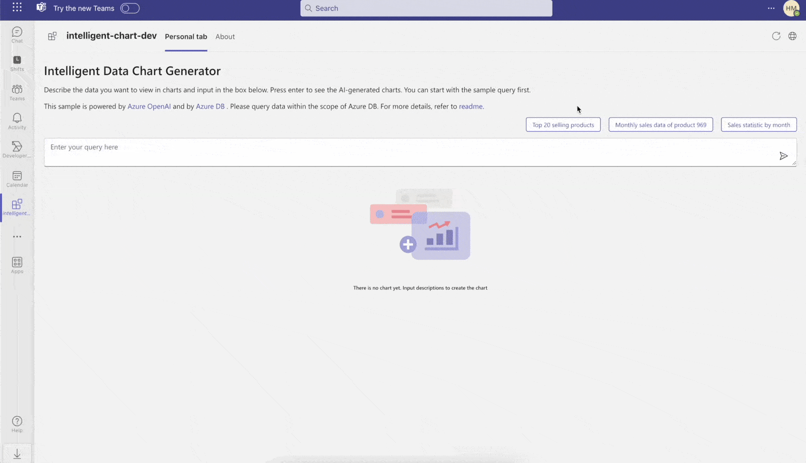

# Getting Started with Intelligent Data Chart Generator

This intelligent Microsoft Teams Tab app is powered by Azure OpenAI, which helps users generating data charts based on users' description of the data chart in human language. There is an input box where users tell the Tab app what data chart they want to generate, and the app interprets user's requirements then generate visual charts. The data is from Azure SQL. This sample demonstrates how to build a seamless and intuitive experience for accessing and interpreting data.



> Note: This sample will only provision [single tenant](https://learn.microsoft.com/azure/active-directory/develop/single-and-multi-tenant-apps#who-can-sign-in-to-your-app) Azure Active Directory app. For multi-tenant support, please refer to this [wiki](https://aka.ms/teamsfx-multi-tenant).

## This sample illustrates

- How to use Azure Open AI to generate data visualization based on verbal descriptions.
- How to display the generated data visualization in Teams tab.
- How to query data from Azure SQL database.
- How to use TeamsFx to build backend hosting on Azure for your tab app.

## Prerequisite to use this sample

- [Node.js](https://nodejs.org/), supported versions: 16, 18
- A Microsoft 365 tenant in which you have permission to upload Teams apps. You can get a free Microsoft 365 developer tenant by joining the [M365 developer program](https://developer.microsoft.com/en-us/microsoft-365/dev-program)
- An [Azure OpenAI](https://aka.ms/azureopenai) resource and an [Azure SQL Database](https://aka.ms/azuredb) resource.
- [Teams Toolkit Visual Studio Code Extension](https://aka.ms/teams-toolkit) version 5.0.0 and higher or [TeamsFx CLI](https://aka.ms/teamsfx-cli)

## Minimal path to awesome

> Here are the instructions to run the sample in **Visual Studio Code**. You can also try to run the app using TeamsFx CLI tool, refer to [Try the Sample with TeamsFx CLI](cli.md)

### Run the app locally

1. Clone the repo to your local workspace or directly download the source code.
2. Open the project in Visual Studio Code.
3. Update the `.env.local.user` file to add your Azure OpenAI configuration. Your configuration should look like this:

   ```
   SECRET_OPENAI_ENDPOINT=https://<your-instance-name>.openai.azure.com/
   SECRET_OPENAI_DEPLOYMENT_NAME=<your-deployment-name>
   SECRET_OPENAI_API_KEY=<your-api-key>
   ```

   > If you have not created an Azure OpenAI resource or deployed a model, please follow [this tutorial](https://learn.microsoft.com/en-us/azure/ai-services/openai/how-to/create-resource?pivots=web-portal) to create one.

4. Update the `.env.local.user` file to add your Azure SQL Database configuration. Your configuration should look like this:

   ```
   SQL_USER=<your-sql-user-name>
   SECRET_SQL_PASSWORD=<your-sql-password>
   SQL_SERVER=<your-sql-server-name>.database.windows.net
   SQL_DATABASE=<your-sql-database-name>
   ```

   > If you have not created an Azure SQL Database resource, please follow [this tutorial](https://learn.microsoft.com/azure/azure-sql/database/single-database-create-quickstart?view=azuresql&tabs=azure-portal) to create one. Once you've set up the Azure database, you can use `/data/script.sql` file to create the table and insert some sample data.

5. Press `F5` to start the app locally.

### Deploy the app to Azure

Deploy your project to Azure by following these steps:

1. Open Teams Toolkit in Visual Studio Code, and sign in your Azure account by clicking the `Sign in to Azure` in the `ACCOUNTS` section from sidebar.
2. After you signed in, select a subscription under your account. The Teams Toolkit will use this subscription to provision Azure resources to host you app.
3. Update the `.env.dev.user` file to add your Azure Open AI and Azure SQL configurations.
4. Open the Teams Toolkit and click `Provision` in the `LIFECYCLE` section. Alternatively open the command palette(Ctrl+Shift+P) and type: `Teams: Provision` command.
5. Open the Teams Toolkit and click `Deploy` in the `LIFECYCLE` section. Alternatively open the command palette(Ctrl+Shift+P) and type: `Teams: Deploy` command.

> Note: Provision Azure cloud resources and deploy to Azure may cause charges to your Azure Subscription.

### Preview the app in Teams

After you have completed the provision and deploy steps in `Deploy the app to Azure` section, you can preview your app in Teams client by following steps below:

1. Open the `Run and Debug` panel from sidebar, or use short key Ctrl+Shift+D.
2. Select `Launch Remote (Edge)` or `Launch Remote (Chrome)` in the launch configuration (a dropdown selection in the upper-left corner).
3. Press the `Start Debugging` button to launch your app, the Teams web client will be automatically opened in your browser, where you will see your app running remotely from Azure.

## Version History

| Date         | Author   | Comments                               |
| ------------ | -------- | -------------------------------------- |
| Jan 8, 2024  | Hui Miao | Onboard sample in Teams Toolkit V5.0.0 |
| Feb 27, 2024 | Hui      | Upgrade Azure Function V4              |

## Feedback

We really appreciate your feedback! If you encounter any issue or error, please report issues to us following the [Supporting Guide](https://github.com/OfficeDev/TeamsFx-Samples/blob/dev/SUPPORT.md). Meanwhile you can make [recording](https://aka.ms/teamsfx-record) of your journey with our product, they really make the product better. Thank you!
